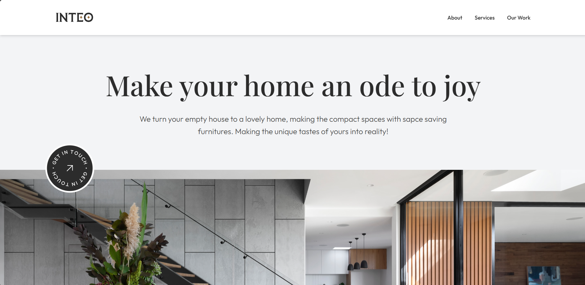
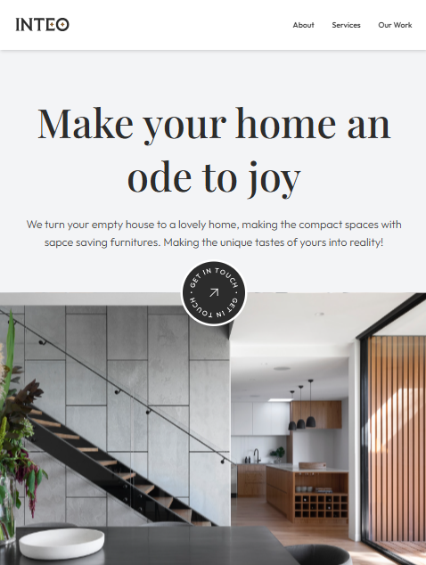
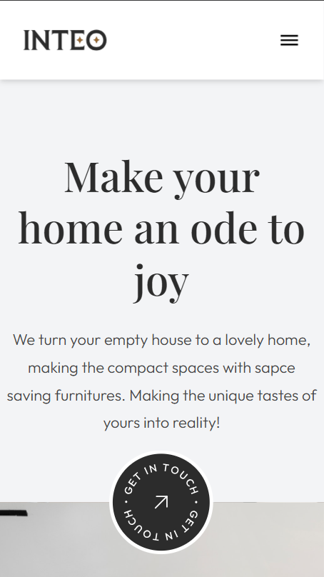

# Estudio de arquitectura

Este es un proyecto de práctica en Astro, donde implementé un diseño de interfaz tomado de una plantilla de Figma sobre un estudio de arquitectura y diseño interior.

---

## 🖼️ Capturas de pantalla

---

## 📌 Tecnologías usadas

- [Astro](https://astro.build/)
- HTML, CSS, JavaScript
- Tailwind CSS
- [Figma](https://www.figma.com/)

---

## 🎨 Diseño

El diseño original de la interfaz fue creado por [Landify y Aravind Solaiappan] en Figma:  
[Enlace a la plantilla original de Figma](https://www.figma.com/community/file/1096849048863088197)

> Nota: Este proyecto es únicamente con fines de práctica y aprendizaje.

### ✨ Adaptaciones realizadas

- Hice un menu para dispositivos moviles.
- Modifique la distribucion de la seccion trabajos recientes ya que no pude adaptarla tal cual al diseño.
